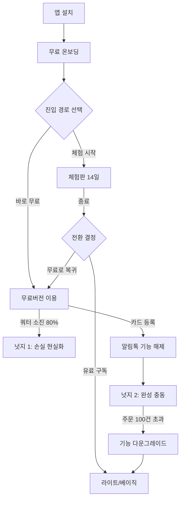

# [PRD] 알파리뷰 무료버전 — Phase 1.5

> **버전**: v0.1 (초안) | **작성일**: 2026-04-20 | **담당**: 규백 | **Appetite**: Medium Batch (4주)
> **관련 문서**: [무료 버전 기획안](https://www.notion.so/348a323fd4af80ec96f4e540da8ac044), [무료 회의 2](https://www.notion.so/348a323fd4af807bb4f4c530eb3a79bb)

---

## 1. Problem

### 1-1. 프로젝트를 시작한 배경은 무엇인가요?

> *이 영역은 작성자가 직접 채웁니다.*

### 1-2. 고객은 어떤 문제를 가지고 있나요?

초기 쇼핑몰 운영자는 **"리뷰 솔루션이 필요한지 판단할 만큼의 체험 기회"** 없이 유료 구독을 결정해야 하는 부담을 안고 있습니다.

### 1-3. 그것이 왜 문제라고 생각했나요?

- **경쟁사 무료 진입 장벽 낮음** — 쿠션 등 경쟁사는 카드 등록 없이도 기본 기능을 체험할 수 있는 구조이며, 알파리뷰의 체험판 종료 후 유료 전환이 유일한 선택지인 구조는 진입 장벽이 상대적으로 높음 *(경쟁사·레퍼런스)*
- **미끼 상품 부재** — 알파앱스 생태계(리뷰·업셀·푸시) 중 알파리뷰는 현재 "업셀·푸시" 수준의 무료 제공만 존재. 리뷰 영역에서 Product-Led Growth 루프가 만들어지지 않음 *(정성적 데이터)*
- **시장 장악력 감소 리스크** — 무료버전을 통한 초기 셀러 확보가 이뤄지지 않으면, 셀러가 성장했을 때 자연스럽게 유료로 전환되는 Lock-in 구조를 만들 수 없음 *(정성적 데이터)*
- **정량적 근거(가상 데이터)** — 초기 셀러(월 주문 30건 이하) 중 체험판 종료 후 유료 전환율은 약 18% 수준으로 추정되며, 무료버전 제공 시 풀 사이즈 자체를 2~3배 확대할 여지가 있음 *(가상 데이터)*

---

## 2. Appetite (베팅 규모)

- **투자 기간**: 4주 (Medium Batch) — 스프린트 6 ~ 스프린트 7
- **핵심 원칙**: "무료의 목표는 유료다" — 기능 무료 제공이 아닌, 유료 전환 루프를 완성하는 것이 목적
- **가드레일**:
  - 라이트 플랜 평균 사용량을 상회하는 무료 한도는 설정 금지 (카니발라이제이션 방지)
  - 기존 유료 고객 이탈률이 2주 연속 5% 이상 증가 시 즉시 롤백 검토
  - 넛지 설계가 동반되지 않은 기능 배포는 지양 (시나리오 없이 기능만 풀지 않음)
  - 기술 부채 최소화를 위해 **무료/유료 DB 분리 로드맵**과 정합성 유지

---

## 3. Solution

### 3-1. 핵심 솔루션

**관리 중심의 미끼형 무료버전을 제공하여, 초기 셀러가 알파리뷰를 일상 루틴으로 체화하게 만들면, 성장 시점에 자연스럽게 유료로 전환되는 Lock-in 루프를 만들 것입니다.**

### 3-2. 솔루션 스케치 (Logic Flow)

**전체 플로우**



**주요 구성요소와 화면 정의**

| 구성요소 | 주요 기능 | 제공 범위(무료) |
|---|---|---|
| **수집 3종 세트** | 리뷰 요청 / 스태프 리뷰 / 소셜리뷰 가져오기 | 통합 쿼터 내에서 제공 |
| **통합 쿼터 대시보드** | 수집 기능별 사용량 슬라이드 바 시각화 | 전량 제공 |
| **재방문 배너** | 이탈 방지용 배너 1종 | 1종만 선택 가능 |
| **관리 기능** | 게시/비게시, 필터링, 키워드, 리뷰 삭제 | 전량 제공 |
| **인스타 피드** | Phase 1 기능 그대로 유지 | 전량 제공 |
| **상하단 고정** | 카페24 게시글 고정 기반 | (데이터 확인 후 확정) |
| **포인트 자동 지급** | — | 잠금 (수동만) |
| **위젯** | — | 미제공 (Phase 2로 연기) |
| **동영상 리뷰 노출** | — | 미제공 (작성은 가능) |
| **리뷰 이관** | — | 미제공 |

### 3-3. 상세 솔루션

#### ① 통합 쿼터 시스템

**핵심 개념**
- 알림톡 + 스태프 리뷰 + 소셜리뷰 가져오기를 **하나의 월간 쿼터**로 묶어 관리
- 기본값: 월 **50건** (데이터 확정 전 가안, 알림톡 30건 가안과 정합 필요)
- 초과 시 과금 또는 다음 달 리셋 (정책 확정 필요)

**UI 와이어프레임**

```
┌──────────────────────────────────────────────────┐
│  이번 달 무료 쿼터                    38 / 50건    │
│  ┌────────────────────────────────────────────┐  │
│  │ ████████████▓▓▓▓▓▒▒▒▒░░░░░░░░░ 76%         │  │
│  └────────────────────────────────────────────┘  │
│  🔵 알림톡 20건  🟢 스태프 12건  🟠 소셜 6건     │
│                                                   │
│  [💡 카드 등록 시 추가 20건 + 유료 전환 시 무제한] │
└──────────────────────────────────────────────────┘
```

**상세 규칙**
- 리뷰 요청 1건 발송 → 리뷰 작성 시 **2회 카운트** (발송+작성)
- 쿼터 사용량에 따라 단계별 넛지 노출 (70% / 90% / 100%)
- 리뷰 작성 경로별 트래킹 필수 (재방문배너, 요청, 스태프, 가져오기)

#### ② 무료 → 체험 → 유료 상태 전환 플로우

| 시나리오 | 진입 상태 | 종료 상태 | 데이터 보존 정책 |
|---|---|---|---|
| 설치 직후 | 신규 | 무료 / 체험 선택 | — |
| 체험판 → 무료 | 체험 | 무료 | 체험 중 설정한 디자인 값은 **기본값 복귀**, 단 경고 팝업 노출 |
| 체험판 → 유료 | 체험 | 유료 | 모든 설정 그대로 유지 |
| 무료 → 체험 | 무료 | 체험 | 쿼터 소진 상태 유지, 체험 종료 후 복귀 시 쿼터 그대로 |
| 무료 → 유료 | 무료 | 유료 | 모든 설정·데이터 그대로 유지 |
| 유료 → 무료 | 유료 | 무료 | 기능 다운그레이드, 한도 초과 설정은 **자동 축소 + 복구 안내** |

#### ③ 카드 등록 플로우

- **Phase 1 (인스타 피드)**: 카드 등록 요구 없음 — 가치 대비 허들 과다
- **Phase 1.5 진입 시**: 알림톡 기능 사용 시점에 **카드 등록 유도** (기능 자체 사용은 가능, 발송 시점에 요구)
- **카드 등록 보상**: 쿼터 20건 추가 지급 + 첫 알림톡 3,000원 포인트 선물
- **언어 프레임**: "업그레이드" 대신 **"카드 등록하고 알림톡 20건 받기"** (이득 프레임 + 구체 숫자)

#### ④ 유료화 넛지 시나리오 (Phase 1.5 우선 3종)

| 넛지명 | 트리거 | 메시지 | 효과 |
|---|---|---|---|
| **한도 도달 경고** | 쿼터 70% / 90% / 100% | "이번 달 한도 X% 소진 — 발송했다면 예상 리뷰 +N건" | 손실 현실화 |
| **셋업 체크리스트** | 가입 직후 | "리뷰 앱 100% 준비까지 4단계 남음" | 완성 충동 (Zeigarnik) |
| **잠긴 기능 Preview** | 위젯·동영상 영역 | "AI 리뷰 답글 사용 시 재구매율 +12%" (가상 데이터) | 손실 + 기회 수치화 |

---

## 4. FAQ

**Q1. 체험판에서 설정한 디자인이 무료로 복귀하면 초기화된다는 것을 사용자가 받아들일까요?**
A. 복귀 직전 경고 팝업으로 **"저장된 설정값 중 N개가 초기화됩니다. 유료 구독 시 그대로 유지됩니다"** 명시. 복귀 후에도 **"이전 설정 복원"** CTA를 대시보드 상단에 2주간 노출하여 전환 기회 제공.

**Q2. 통합 쿼터에서 한 기능(예: 알림톡)을 몰아쓰면 다른 기능을 못 쓰게 되는데, 불만이 예상됩니다.**
A. 이것은 **의도된 설계**입니다. 통합 쿼터는 셀러의 **선택·우선순위 인지**를 학습시키는 장치이기도 합니다. 다만 쿼터 시각화에서 각 기능별 소진 현황을 색상으로 명확히 보여주고, 특정 기능에 치중될 때 다른 기능의 가치를 안내하는 툴팁을 제공합니다.

**Q3. 동영상 리뷰 작성은 되는데 노출이 안 된다는 것을 고객이 어뷰징이라 느끼지 않을까요?**
A. 작성 직후 **"동영상 리뷰는 유료 플랜에서 고객에게 노출됩니다. 유료 전환 시 이미 수집된 동영상이 자동 노출됩니다"** 안내 배너 고정 노출. 페인포인트를 가시화하되, "저장되어 있음"을 강조하여 손실이 아닌 **지연된 자산**으로 프레이밍.

**Q4. 스태프 리뷰 수량 제한이 어뷰징 인지를 드러내는 문제는 어떻게 해결하나요?**
A. 통합 쿼터 방식이 이 문제를 우회합니다. **"스태프 리뷰 자체의 제한"**이 아닌 **"이번 달 수집 총량"**으로 커뮤니케이션하며, AI 자동 작성 기능은 명시적으로 배제하여 시장 교란 우려를 차단합니다.

**Q5. 월 주문 100건 초과 시 기능 다운그레이드가 갑작스러우면 이탈로 이어지지 않을까요?**
A. 70건 / 90건 단계적 알림 + 초과 직전 "14일 유예기간" 제공. 유예 동안 유료 전환 시 서비스 중단 없이 연속 이용 가능. 갑작스러운 차단이 아닌 **예고된 압력**으로 설계.

**Q6. 무료/유료 DB 분리 로드맵과 Phase 1.5 일정이 충돌하지 않나요?**
A. Phase 1.5는 **기존 DB 구조 위에서 논리적 분리(계정 속성 기반 필터링)**로 우선 구현. 물리적 분리는 백엔드 로드맵에 따라 점진 마이그레이션. 이를 위해 모든 무료 기능은 `plan_type = free` 플래그로 명확히 구분되어야 함.

**Q7. 리뷰 이관을 무료에서 차단하면 대형 업체가 "일단 무료로 받아보자"는 유입은 막히지 않나요?**
A. 이것은 **의도된 제한**입니다. 무료버전 타겟은 대형 업체가 아닌 초기 셀러이며, 이관이 필요한 업체는 별도 마이그레이션 상담(유료 서비스)으로 분기시켜 리소스를 관리합니다.

**Q8. 위젯이 없는데 포토리뷰·평점을 어떻게 쇼핑몰에 보여주나요?**
A. Phase 1.5에서는 **쇼핑몰 노출 자체가 Out of Scope**입니다. 관리 기능만 제공하며, 노출이 필요한 셀러는 Phase 2 출시 또는 유료 전환을 대기합니다. 이 자체가 유료 전환 넛지입니다.

---

## 5. Map the Scopes

### Unknown (아직 알아보는 단계)

- **통합 쿼터 UI/UX 최종안** — 슬라이드 바 형태가 모바일 대시보드에서도 직관적으로 보이는지, 항목별 색상 구분이 접근성(WCAG AA)을 만족하는지 검증 필요
- **무료→체험→유료 상태 전환 플로우의 엣지 케이스** — 체험 중 쿼터 소진, 유료→무료 다운그레이드 시 초과 설정 처리, 구독 실패 후 무료 복귀 등
- **알림톡 무료 제공 적정 건수** — 플랜별 월별 주문량 평균/중간값 데이터(데이터1) 확정 후 결정 (현재 가안: 월 30건 / 통합 쿼터 50건)
- **상하단 고정 제공 방식** — 플랜별 상하단 고정 사용 현황(데이터6) 확인 후 제공/미제공/개수제한 중 결정
- **리뷰 연결 활용도** — 플랜별 리뷰 연결 개수(데이터7) 확인 후 1개 제한의 유효성 검증
- **카드 등록 허들의 전환 효과** — 카드 등록 단계의 이탈률 vs 이후 전환율 증분 검증
- **Lock된 기능의 노출 방식** — "완전 비노출" vs "미리보기 + 저장 시 팝업" 중 A/B 테스트 필요

### Known (개발 범위를 위한 세팅)

> *이 영역은 FSD 단계에서 개발자가 채웁니다.*

---

## 6. No-Gos (Out of Scope)

- 위젯 제공 전반 (포토리뷰·평점·게시판 위젯) — **Phase 2로 연기**
- 동영상 리뷰 **쇼핑몰 노출** — 작성만 허용, 노출 차단
- 리뷰 이관 기능 — 대형 업체 유입 방지
- 포인트 자동 지급 — 수동만 허용
- 리뷰 작성 리마인더 알림톡 — Phase 3로 연기
- 회원가입 유도 알림톡 — Phase 3로 연기
- AI 기반 스태프 리뷰 자동 작성 — **시장 교란 우려로 영구 배제**
- 사회 비교 넛지 (업종 벤치마크, 상위 N%) — 데이터 축적 후 중기 이후 적용
- 주간 리뷰 성과 리포트 — Phase 3로 연기
- 프라이싱 재정의 — 별도 프로젝트
- 스마트스토어 무료 제공 — Phase 2 검토

---

## 7. Definition of Done (완료 조건)

### 정량 지표 (우선순위 순)

1. **무료 → 유료 전환율** (핵심 KPI)
   - 목표: 무료 가입 후 90일 이내 유료 전환율 **≥ 8%** *(가상 데이터 기반 가안)*
   - 체험 미경유 직접 유료 전환 + 무료→체험→유료 경로 합산

2. **무료 유저 확보 및 리텐션** (핵심 KPI)
   - 목표: 출시 후 90일 누적 무료 가입 **1,000개 쇼핑몰 이상** *(가상 가안)*
   - D7 리텐션 **≥ 40%**, D30 리텐션 **≥ 20%**

3. **카드 등록률**
   - 알림톡 첫 발송 시도 사용자 중 카드 등록 완료율 **≥ 50%**

4. **기능 활성화율**
   - 가입 후 14일 이내 수집 3종 중 최소 1개 사용 **≥ 60%**

### 정성 지표

- 통합 쿼터 UI에 대한 초기 사용자 혼동 CS 건수 주간 **10건 이하** 유지
- Phase 1.5 출시 6주 내 유료 고객 이탈률 증가 **5% 이하**

### 출시 전 필수 조건

- 모니터링 대시보드 구축 완료 (온보딩 진입수·체험수·과금수·무료버전수·전환율)
- 롤백 시나리오 검증 (사용량 제한 강화 → 극단적 기능 제한 → 무료버전 폐지)
- 무료/유료 플래그 분기 로직 QA 완료

---

## 8. Reference (참고자료)

- [무료 버전 기획안 v1](https://www.notion.so/348a323fd4af80ec96f4e540da8ac044) — 초기 기획 문서, 레버·넛지 4대 원리 상세 기술
- [무료 회의 2](https://www.notion.so/348a323fd4af807bb4f4c530eb3a79bb) — Phase 1.5 의사결정 회의록
- **쿠션 (경쟁사)** — 카드 등록 없이 기본 기능 제공하는 구조, 진입 장벽 낮은 사례
- **Kahneman, D. (2011)** — 손실 회피 성향: 동일 크기의 이익보다 손실에 2배 민감
- **Zeigarnik effect** — 미완성된 일이 기억에 오래 남고 해결 충동을 만든다는 심리학 원리, 셋업 체크리스트 설계의 이론적 근거

---

> **다음 단계**
> 1. 이 PRD에 대한 이해관계자 리뷰 (대표·기획·개발·디자인)
> 2. 미결 사항 확정 (카드 등록 정책, 통합 쿼터 범위, Phase 1.5 최종 범위)
> 3. 필수 데이터 1·6·7 수집 완료
> 4. FSD 작성 착수 (개발자)
> 5. UX 플로우·통합 쿼터 UI 시안 (디자인)
